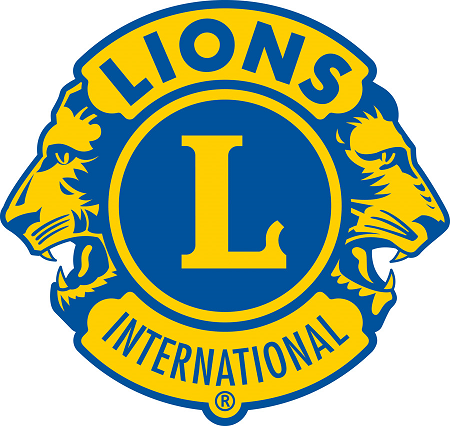
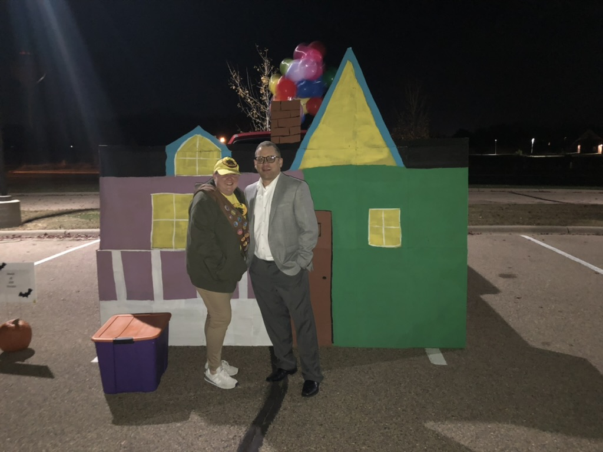

# New Prague Area Lions

New Prague Area Lions is a centennial club chartered in January 2017 by local residents who want to help our local community.

## Community Support
---

We strive to servie our community by providing for needs based on request, or by club members identifying a need.
- Childhood cancer
- Eye Glasses
- Can Do Canines
- Supporting local schools to help students and families

## Club Projects
---

### Highway Cleanup

The New Prague Area Lions have adopted a stretch of highway on MN-19/13, and do a bi-annual cleanup in the Spring and Fall. 

### City Park Cleanup

The City of New Prague has several parks, and the New Prague Area Lions have adopted the XXXX Park on the east side of town and do a bi-annual cleanup in the spring and fal

## Local fundraising
---

### Drive Through Trick or Treat

In October of each year the lions hosts a drive through trick or treat that is open to all local families.

The Lions take good will donations that we use to give back to our community

### Lions Christmas Event

In December of each year the Lions invite Santa to visit.

We docorate the event and give opporunities for kids to visit with Santa.

### Lion Mints
- Ettlins Cafe
- Laus Bakery 

## Club Leadership
---

| Position | Name |
| --------- | ------------ |
| President | Aaron Tesch |
| 1st Vice President | Apryl Tesch |
| 2nd Vice President | Matt Miller |
| Secretary | Aaron Tesch |
| Treasurer | Robert Paulen |
| Membership Chair | Ulrich Ettlin |
